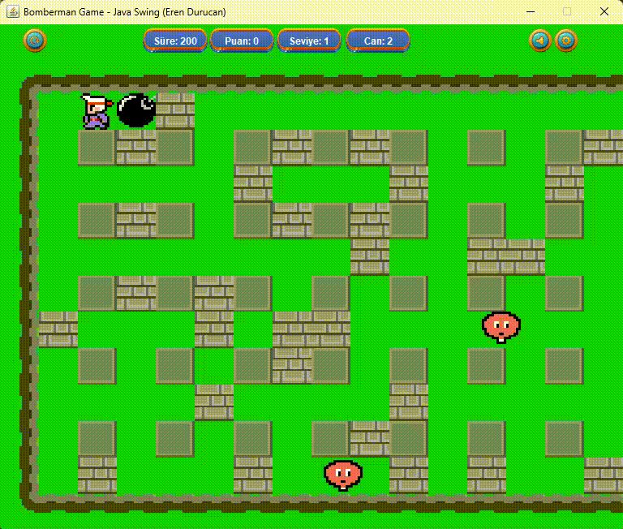
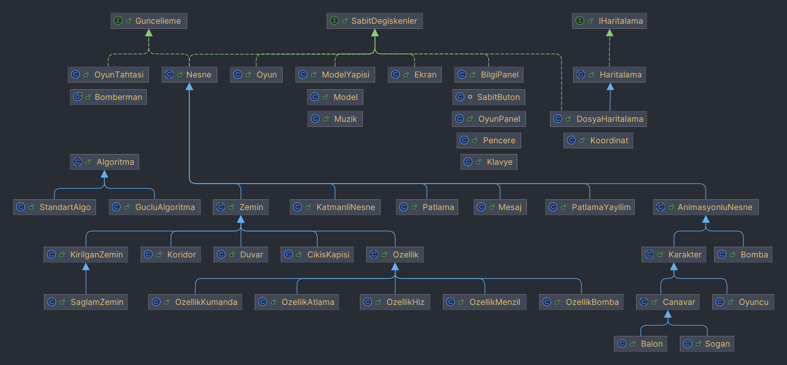

# Bomberman Java Game



## Overview
This project is a Java application that implements the Bomberman game using Java Swing. The player's goal is to reach the door behind destructible walls and blow up monsters to pass through the door. The player must achieve these objectives within a specified time (200 seconds). The project includes aspects of game development, graphical design, algorithm development, and multithreading.

## Structure of the Assignment
The Bomberman game is developed using the following classes and components:




### Mapping
- **FileMapping**: A class for reading and processing map files.
- **Coordinate**: Manages the coordinates of objects in the game.

### Constants
- **Screen**: Defines the screen settings and dimensions of the game.
- **ModelStructure**: Defines the structure of models in the game.

### Object
- **InfoPanel**: A panel that provides the player with information about the game.
- **Keyboard**: Manages the player's interaction with the keyboard.
- **Window**: Manages the settings of the game window.
- **GamePanel**: The main panel displayed during the game.
- **FixedButton**: Contains settings for fixed buttons.

### Update
- **Game**: The main class of the game, which starts and manages the game.
- **GameBoard**: The main area where the game is played.
- **Bomberman**: The main character controlled by the player.

### Algorithm
- **StrongAlgorithm**: Algorithms that increase the difficulty of the game.
- **StandardAlgorithm**: Standard game algorithms.

### LayeredObject
- **Explosion**: Manages the effects and impacts of bomb explosions.
- **ExitDoor**: The door the player must reach to finish the game.
- **Ground**: Defines the types of ground in the game.
- **Wall**: Destructible and indestructible walls.
- **ExplosionPropagation**: The algorithm for spreading the effect of bomb explosions.
- **FragileGround**: Destructible ground.
- **SolidGround**: Indestructible ground.
- **Corridor**: Corridors where the player moves.

### AnimatedObject
- **Message**: Messages and notifications for the player.
- **Bomb**: Bombs placed by the player.
- **Character**: All characters in the game.
- **Player**: The character controlled by the player.
- **Enemy**: Enemy characters in the game.

### Feature
- **FeatureJump**: Grants the player the ability to jump.
- **FeatureRange**: Increases the range of bombs.
- **FeatureBomb**: Grants the ability to place more bombs.
- **FeatureRemote**: Allows remote detonation of bombs.
- **FeatureSpeed**: Increases the player's movement speed.

## Gameplay
1. **Start Screen**:
   - At the beginning of the game, the player is asked to select which feature will appear.
   - The game starts when the start button is pressed.

2. **Game Area**:
   - A grid of 15x5 fixed walls and randomly placed destructible walls is created.
   - The player can move up, down, left, and right, and place bombs with the z key.

3. **Monsters**:
   - Six monsters are randomly created at the start of the game.
   - Monsters move randomly and end the game if they contact the player.

4. **Bombs**:
   - The player places a bomb, which explodes after 3 seconds.
   - The explosion destroys monsters and destructible walls.

5. **Features**:
   - Yellow, green, blue, orange, and turquoise icons grant the player different abilities. These icons are hidden behind destructible walls and grant specific abilities when collected.

## Features
The player can gain different abilities throughout the game, which provide advantages. These abilities are hidden behind destructible walls and grant specific skills when collected. Here are brief descriptions of these features:

1. **Yellow icon: Double Bomb** - Allows the player to place two bombs simultaneously.

2. **Green icon: Range Increase** - Increases the explosion range of the player's bombs by one square in each direction.

3. **Blue icon: Wall Jumping** - Grants the player the ability to jump over destructible walls.

4. **Orange icon: Speed Up** - Increases the player's movement speed.

5. **Turquoise icon: Bomb Remote** - Allows the player to detonate bombs remotely.

## Challenges and Solutions
1. **Multithreading Issues**:
   - Synchronization issues were encountered due to player and monster movements running in separate threads.
   - Synchronized blocks were used to resolve these issues and ensure coordination between threads.

2. **Random Map Generation**:
   - The map generation algorithm was designed to place destructible walls randomly, creating a new map each game.
   - However, some maps became impassable. The algorithm was optimized to prevent this.

3. **Graphical Design**:
   - Game graphics were kept simple but clear and functional.
   - Walls, monsters, and the player character were made distinguishable and visually clear.

## Working and Non-working Parts
### Working Parts:
- Player movements, constraints, and bomb placement.
- Player and monster behaviors using multithreading.
- Destruction of destructible walls by bomb explosions, ending the game if the player is hit, removing monsters if they are hit, and spawning an onion if the door or a feature is hit.
- Random movements of monsters and ending the game if they contact the player.
- Functional features granting the player different abilities.
- Finding the door and passing through it after killing all monsters.
- Timer functionality, including pausing and ending the game when the time runs out.
- Saving game state to a file upon pausing and restoring it upon resumption (File I/O Integration).
- Ability to change features via the settings menu.
- Functional start screen.
- Implementation of level and health systems.

### Non-working or Incomplete Parts:
- No issues were identified in both the GUI and Java Swing source code.

## Installation Instructions

To run the Bomberman game on your local machine, follow these steps:

1. Clone the Repository:
   ```sh
   git clone https://github.com/erendrcnn/bomberman-game-java-swing.git
   cd bomberman-game-java-swing
   ```

2. Install Java Development Kit (JDK): Ensure that you have JDK 8 or higher installed on your machine. You can download it from Oracle's official site or use a package manager to install it.

3. Compile the Code: Navigate to the src directory and compile the Java files:
   ```sh
   javac -d ../bin $(find . -name "*.java")
   ```

4. Run the Game: After compilation, navigate to the bin directory and run the main class:
   ```sh
   cd ../bin
   java Main
   ```

5. Enjoy the Game! You should now be able to play the Bomberman game on your machine.